# Commands

### Cloning Meet the Octocat repository


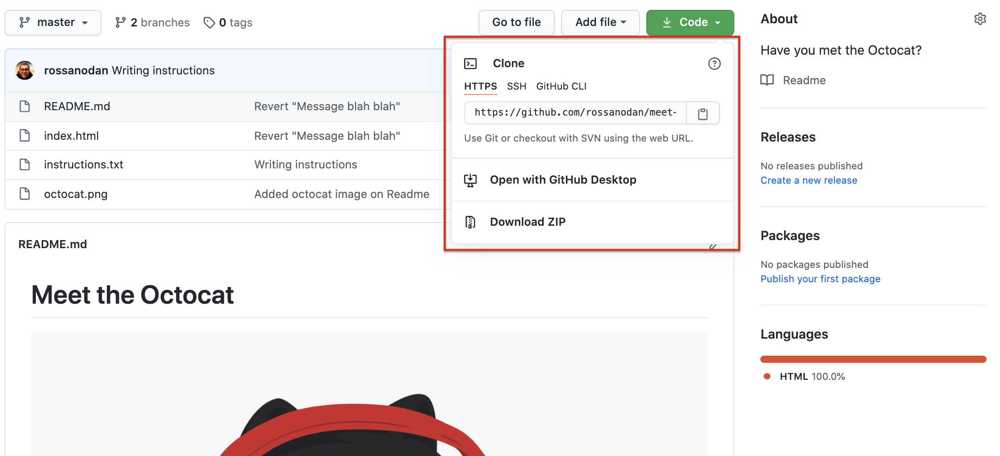

```
git clone https://github.com/rossanodan/meet-the-octocat.git
```

---

### Forking a repository

What does it mean?
Why we do fork?

---

### Creating a new branch

```
git checkout -b rossanodan-uda
```

or

```
git branch rossanodan-uda
git checkout rossanodan-uda
```

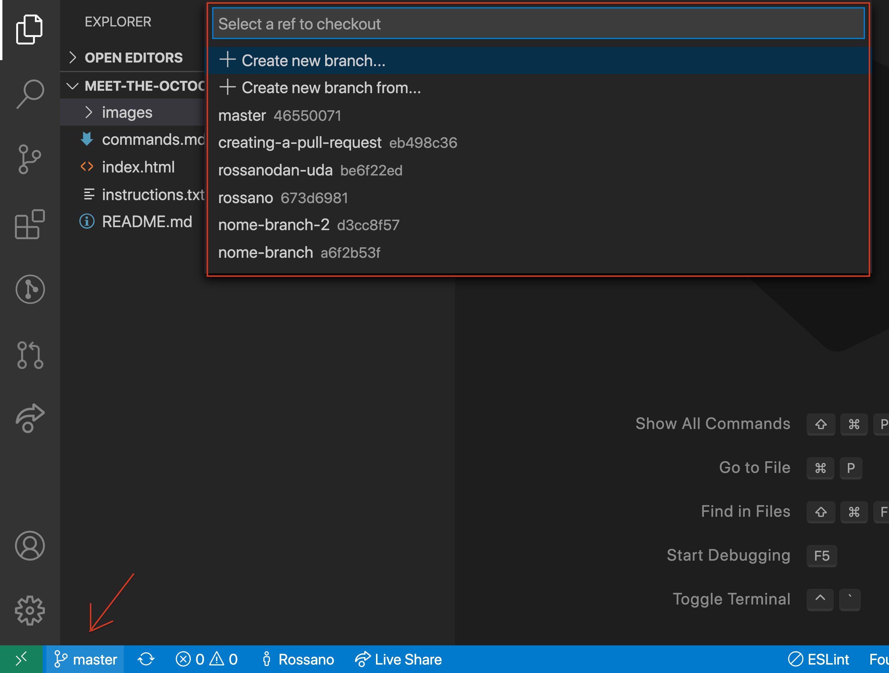

---

### Listing all branches

```
git branch
```

---

### Pushing changes

```
git add .
```

or

```
git add path/to/specific/file.txt
```

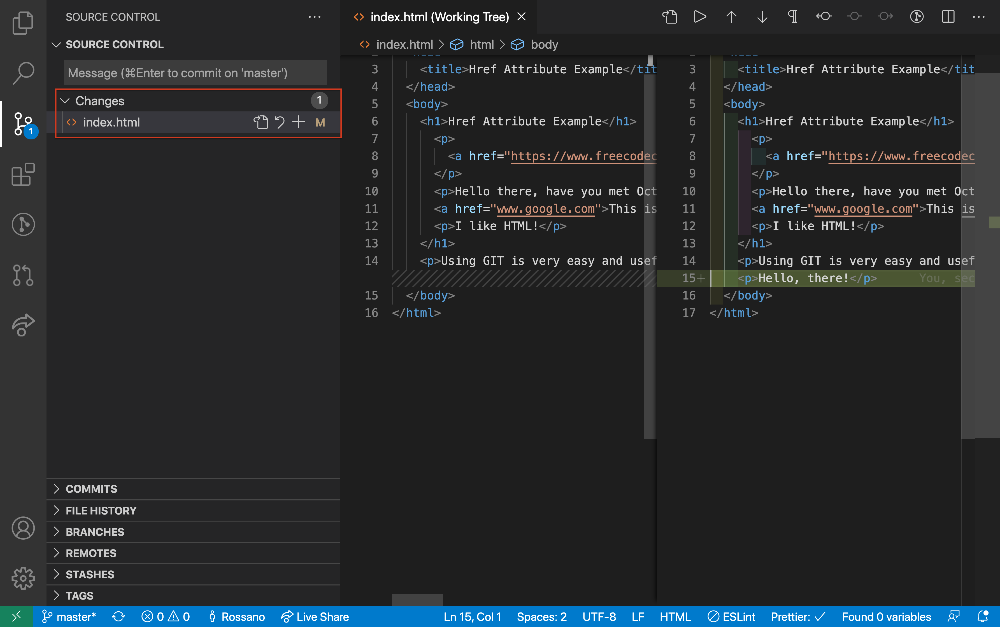


If you need to discard your changes

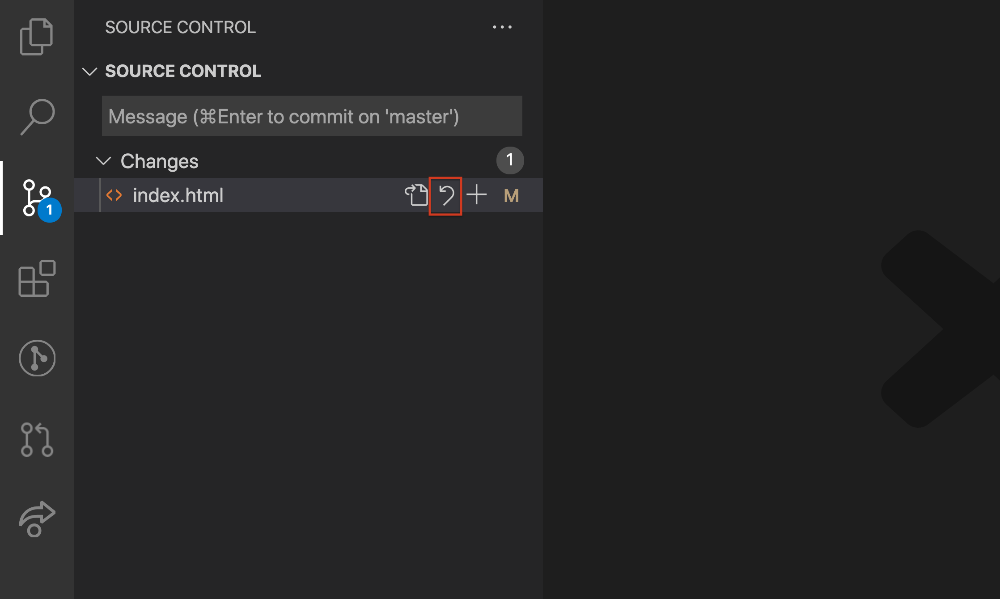

then

```
git commit -m "rossanodan-uda: hello, there"
```

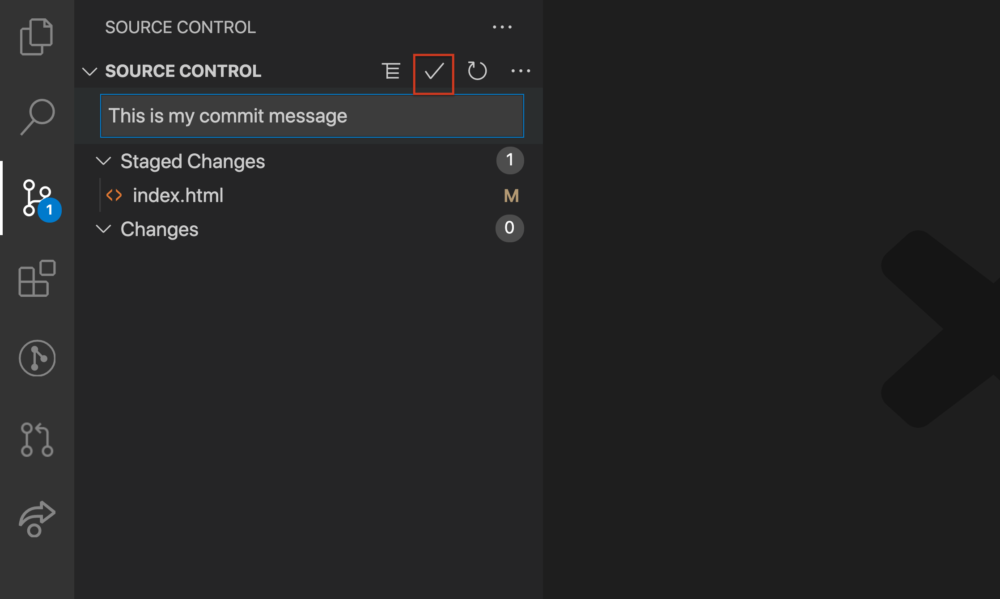

and finally

```
git push
```

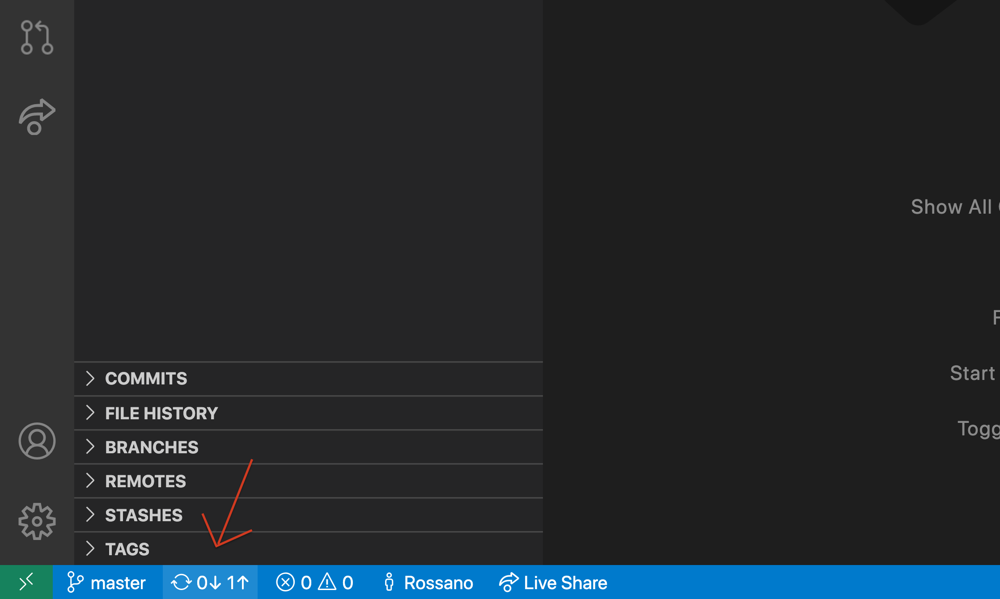

If you need to undo the last commit

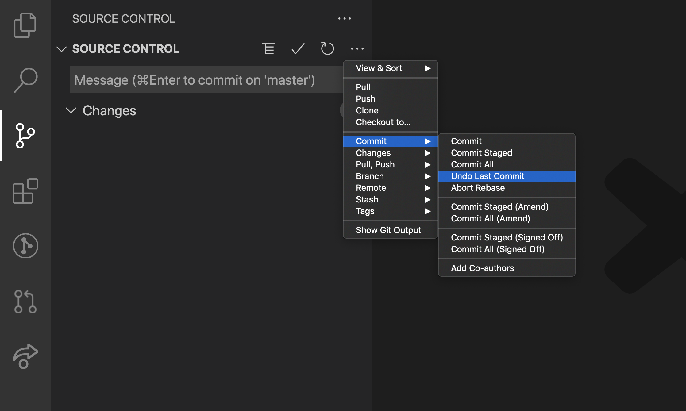

If this branch doesn't exist in the remote repository, GIT will ask you to create it with a specific command

```
git push --set-upstream origin rossanoda-uda
```

or

```
git push -u origin rossanodan-uda
```

---

### Creating a pull request


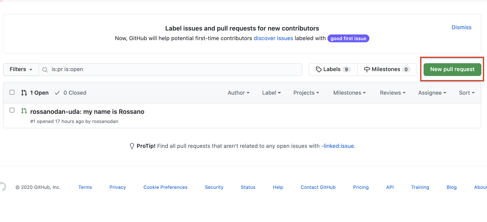
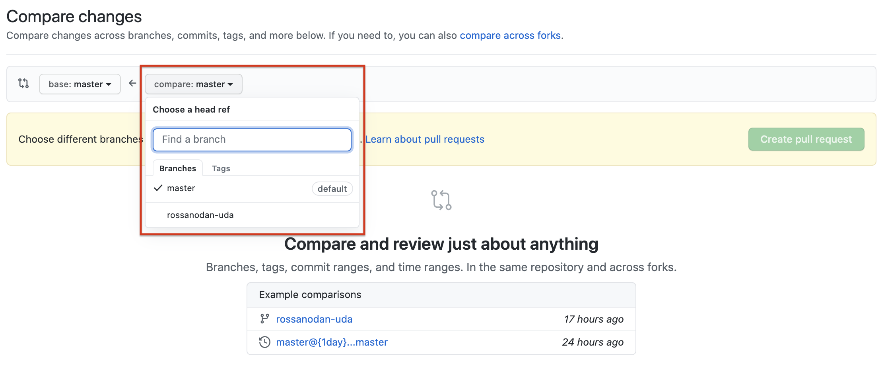
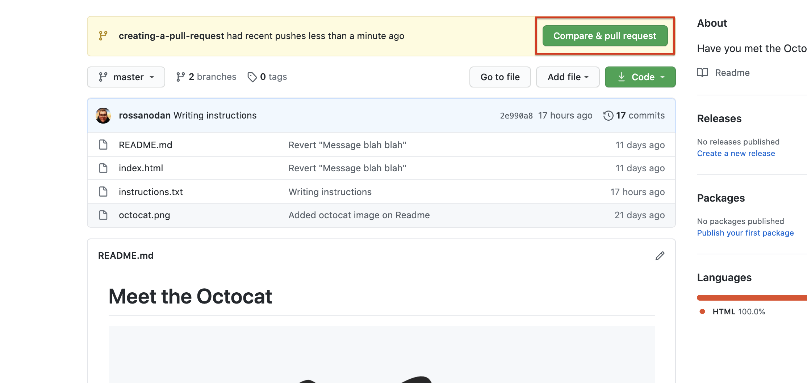
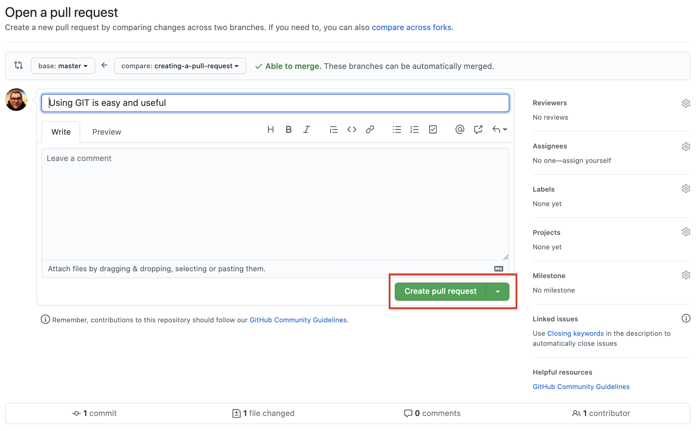
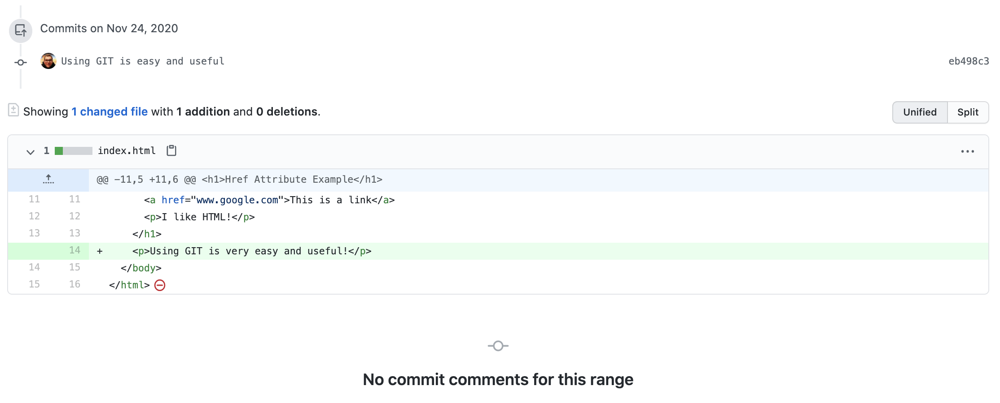

---

### Commenting a pull request for code review

Or simply for a discussion that may involve more people in the team!

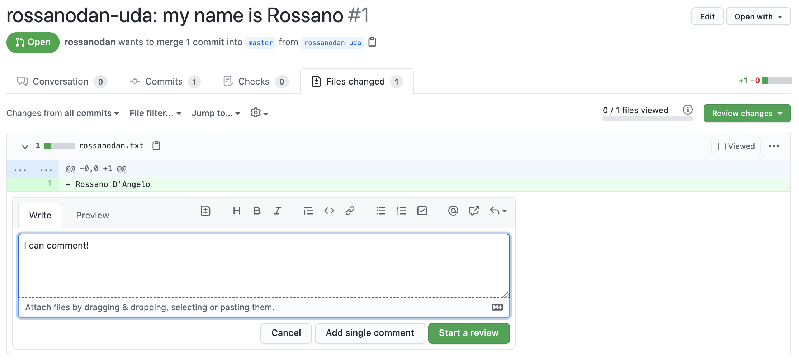
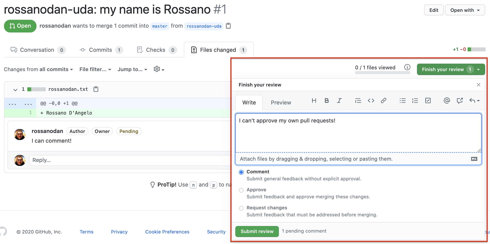

---

### Merging a pull request

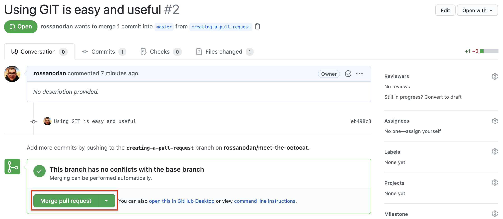
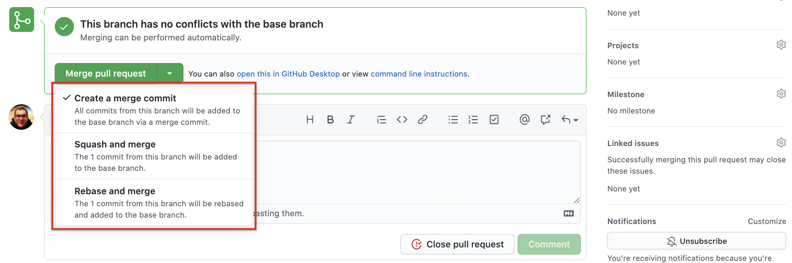
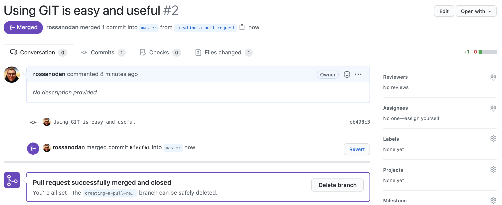

### Visual Studio Code fully integrated with GitHub


